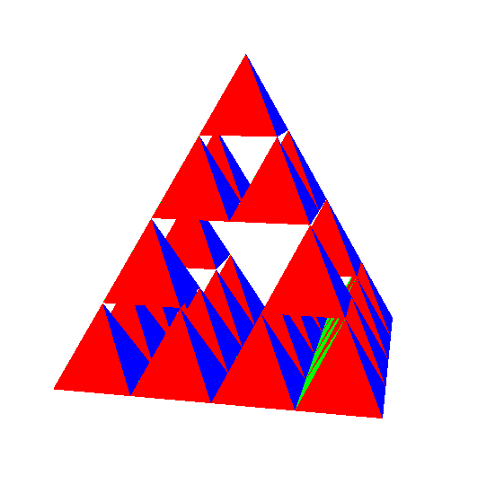

# Sierpinski's Triangle - SDL3 + OpenGL Version
This is my implementation of Sierpinski's Triangle, also known as a recursive triangle, written in SDL3 and OpenGL.

## Building and running
To build the project, make sure you have SDL3 installed on your system. You can then run the following to compile the project:

```bash
git clone https://github.com/BrickSigma/Sierpinski-Triangle-OpenGL.git
cd Sierpinski-Triangle-OpenGL
git submodule init
git submodule update
make
```

# Controls
- Use WASD to move around, and SHIFT and CTRL keys to move up and down.
- Use your mouse to look around.
- The UP/DOWN arrow keys increase/decrease the number of triangles subdivided. (**Note:** Since this is a recursive implementation, if you increase it to a depth of more than 8 or so the app will slow down, lag, and possibly crash).
- I've also added gamepad controller support, so you can connect your favorite controller to use as well. The controls are close to Minecraft's controls: left joystick for movement, right for looking around, and A and B buttons for moving up and down.

# Screenshots
